# MCDA CLI

`mcda` is a JSON-first command-line tool for multi-criteria decision analysis. The current
implementation supports two analysis methods:

- `weighted-sum`: normalizes each criterion, applies resolved weights, and returns a clear
  score-based ranking.
- `electre-iii`: uses thresholds, vetoes, and outranking credibility to expose cases where
  options are not cleanly comparable.

- Create an MCDA project.
- Add participants, alternatives, and criteria.
- Record participant weights, thresholds, and performance scores.
- Aggregate participant inputs.
- Run weighted-sum or ELECTRE III analysis.
- Inspect the resulting candidate ranking.

Generated project data is stored under a project-local `.mcda/` directory. The surrounding
project directory stays available for notes, spreadsheets, source files, and other working
materials.

This repository is early-stage. The implemented workflow is useful and tested, but import
commands, reports, briefing generation, and sensitivity analysis are still planned work.

---

## Installation

From this repository:

```bash
pip install -e .
```

You can also run the CLI without installing the entrypoint:

```bash
python -m mcda.cli --help
```

After installation, use:

```bash
mcda --help
```

---

## Core Concepts

### Projects

An MCDA project is a normal directory containing `.mcda/meta.json`.

```text
office_lease_selection/
  .mcda/
    meta.json
    alternatives/
    criteria/
    participants/
    weights/
    thresholds/
    perf/
    policies/
    sessions/
    results/
```

Commands find the project by walking upward from your current directory until they find
`.mcda/meta.json`. You can also pass `--project <path>` from anywhere.

### JSON First

Commands return JSON by default:

```bash
mcda info
```

The response shape is:

```json
{
  "data": {},
  "warnings": []
}
```

Use `--human` when you want concise human-readable output:

```bash
mcda --human info
```

Errors are structured JSON by default:

```json
{
  "error": {
    "code": "missing_project",
    "message": "No .mcda directory found at /path",
    "details": {}
  }
}
```

### IDs

IDs are used in filenames, so they must be simple identifiers:

```text
^[a-zA-Z_][a-zA-Z0-9_]*$
```

Good:

```text
downtown_loft
annual_cost
alice
```

Bad:

```text
downtown-loft
annual cost
2026_option
```

### Alternatives

Alternatives are the options being evaluated.

Two types are supported:

- `candidate`: eligible for the final recommendation.
- `reference`: included for comparison, but excluded from the default candidate ranking.

Reference alternatives are useful for baselines such as the current supplier, current
office, or status quo. They help answer “is switching worth it?” without letting the
baseline accidentally become the recommended new option.

### Criteria

Criteria describe what matters.

A criterion can be:

- a leaf criterion, with `direction` of `min` or `max`
- a group criterion, created with `crit add-group`

Only leaf criteria receive performance values and thresholds. Groups are used to organize
criteria and receive local weights.

### Weights

Participants submit raw local weights. Raw weights do not need to sum to 1. The analyzer
normalizes sibling weights and then computes global leaf weights.

For example:

```text
financial = 30
commute_time = 25
space_quality = 30
lease_flexibility = 15
```

If `annual_cost` is the only child under `financial`, then `annual_cost` inherits the
global weight of `financial`.

### Thresholds

ELECTRE III uses three thresholds per leaf criterion:

- `q`: indifference threshold
- `p`: preference threshold
- `v`: veto threshold

Use `--no-veto` for criteria where no veto should apply.

### Performance Values

Performance values score each alternative on each leaf criterion. For `max` criteria,
higher values are better. For `min` criteria, lower values are better.

### Aggregation

The current analyzer aggregates across all project participants.

Default strategies:

- weights: `median`
- performance values: `confidence-weighted-mean`
- thresholds: `median`

You can override these in `analyze run`.

### Analysis Methods

Use weighted-sum when you want a clear score-based recommendation:

```bash
mcda analyze run --method weighted-sum
```

Weighted-sum normalizes each criterion to a 0-1 scale, reverses `min` criteria so higher
normalized values are better, multiplies by resolved weights, and sums the contributions.
It is easy to explain and always produces a total score.

Use ELECTRE III when thresholds, vetoes, and incomparability matter:

```bash
mcda analyze run --method electre-iii
```

ELECTRE III asks whether one alternative credibly outranks another. It may produce a tie
or incomparability when the evidence does not support a clean ordering. That is often a
feature, not a failure.

---

## Command Reference

### Global Options

```bash
mcda --project <path> ...
mcda --human ...
mcda --quiet ...
```

`--project <path>` points to a project root directory containing `.mcda/`.

`--human` switches from default JSON output to a simpler human-readable presentation.

`--quiet` is reserved for suppressing non-data human output.

### Project Commands

Create a project:

```bash
mcda init <name> [--description "..."]
```

Show project status:

```bash
mcda info
```

### Participant Commands

Add participants:

```bash
mcda participant add <id> "<name>" [--bio "..."]
```

List participants:

```bash
mcda participant list
```

Show one participant:

```bash
mcda participant show <id>
```

Set a trait:

```bash
mcda participant set-trait <id> <key> <json-value>
```

Examples:

```bash
mcda participant set-trait alice role '"operations"'
mcda participant set-trait alice years_experience 10
```

Set scope:

```bash
mcda participant set-scope <id> --may-weight true
mcda participant set-scope <id> --may-weight false
```

The current implementation supports `may_weight`; criterion-specific evaluation scope is
planned but not yet implemented.

### Alternative Commands

Add an alternative:

```bash
mcda alt add <id> "<name>" [--type candidate|reference]
```

List alternatives:

```bash
mcda alt list
mcda alt list --type candidate
mcda alt list --type reference
```

Show an alternative:

```bash
mcda alt show <id>
```

Retag an alternative:

```bash
mcda alt tag <id> --as candidate
mcda alt tag <id> --as reference
```

### Criterion Commands

Add a leaf criterion:

```bash
mcda crit add <id> "<name>" --direction min|max --unit "<unit>"
```

Add a criterion under a group:

```bash
mcda crit add <id> "<name>" --direction min|max --unit "<unit>" --parent <group-id>
```

Add a group:

```bash
mcda crit add-group <id> "<name>"
```

List criteria:

```bash
mcda crit list
```

Show one criterion:

```bash
mcda crit show <id>
```

### Weight Commands

Set a participant's local weight:

```bash
mcda weights set <participant-id> <criterion-id> <value> [--confidence 0.0-1.0]
```

Examples:

```bash
mcda weights set alice financial 30 --confidence 0.9
mcda weights set alice commute_time 25 --confidence 0.8
```

Show weight records:

```bash
mcda weights show
```

### Threshold Commands

Set thresholds for a leaf criterion:

```bash
mcda thresholds set <participant-id> <criterion-id> --q <value> --p <value> --v <value>
```

Set thresholds with no veto:

```bash
mcda thresholds set <participant-id> <criterion-id> --q <value> --p <value> --no-veto
```

Show threshold records:

```bash
mcda thresholds show
```

### Performance Commands

Set a performance value:

```bash
mcda perf set <participant-id> <alternative-id> <criterion-id> <value> [--confidence 0.0-1.0]
```

Record an abstention:

```bash
mcda perf abstain <participant-id> <alternative-id> <criterion-id> --reason "..."
```

Show performance records:

```bash
mcda perf show
```

### Policy Commands

Set a missing-data policy:

```bash
mcda policy set <key> <value> --by <participant-id> [--rationale "..."]
```

Show current policies:

```bash
mcda policy list
```

Current defaults:

```text
perf-missing = exclude-participant
perf-abstention = exclude-participant
weights-missing = exclude-participant
thresholds-missing = exclude-participant
```

### Session Commands

Start a session:

```bash
mcda session start --id <session-id> --participants <id> --participants <id>
```

Check session status:

```bash
mcda session status
```

List sessions:

```bash
mcda session list
```

Close a session:

```bash
mcda session close --notes "..."
```

When a session is active, new append-style records include a `session` field.

### Analysis Commands

Run weighted-sum:

```bash
mcda analyze run --method weighted-sum
```

Run ELECTRE III:

```bash
mcda analyze run --method electre-iii
```

`electre-iii` is the default method, so `mcda analyze run` is equivalent to
`mcda analyze run --method electre-iii`.

Override aggregation:

```bash
mcda analyze run --method weighted-sum --weights-from median --perf-from confidence-weighted-mean
```

Use one participant for all values:

```bash
mcda analyze run --method weighted-sum --participant alice
```

Override lambda for ELECTRE III:

```bash
mcda analyze run --method electre-iii --lambda 0.8
```

Show the latest candidate ranking:

```bash
mcda analyze ranking
```

Include reference alternatives:

```bash
mcda analyze ranking --include-references
```

---

## Full Example: Choosing An Office Lease

This example walks through a complete decision. The team needs to choose a new office
lease for a 35-person software company.

There are three candidate offices:

- `downtown_loft`
- `midtown_suite`
- `suburban_campus`

There is also one reference alternative:

- `current_office`

The current office is included so the team can compare the new options to the status quo,
but it should not be selected as the default recommendation.

### 1. Create The Project

```bash
mcda init office_lease_selection --description "Select the best office lease for the next three years."
cd office_lease_selection
```

Check the project:

```bash
mcda info
```

The project data now lives under:

```text
office_lease_selection/.mcda/
```

### 2. Add Participants

```bash
mcda participant add alice "Alice Rivera"
mcda participant add bob "Bob Chen"
mcda participant add carol "Carol Singh"
```

Add a few traits:

```bash
mcda participant set-trait alice role '"operations"'
mcda participant set-trait alice years_experience 10

mcda participant set-trait bob role '"engineering"'
mcda participant set-trait bob years_experience 7

mcda participant set-trait carol role '"finance"'
mcda participant set-trait carol years_experience 12
```

### 3. Add Alternatives

```bash
mcda alt add downtown_loft "Downtown Loft" --type candidate
mcda alt add midtown_suite "Midtown Suite" --type candidate
mcda alt add suburban_campus "Suburban Campus" --type candidate
mcda alt add current_office "Current Office" --type reference
```

### 4. Add Criteria

The team will evaluate each office by:

- annual cost
- commute time
- space quality
- lease flexibility

`annual_cost` sits under a `financial` group, which exercises hierarchical weighting.

```bash
mcda crit add-group financial "Financial"
mcda crit add annual_cost "Annual cost" --direction min --unit "thousands USD per year" --parent financial
mcda crit add commute_time "Commute time" --direction min --unit "average minutes"
mcda crit add space_quality "Space quality" --direction max --unit "score 0-100"
mcda crit add lease_flexibility "Lease flexibility" --direction max --unit "score 0-100"
```

Interpretation:

- `annual_cost` is `min`: lower cost is better.
- `commute_time` is `min`: shorter commute is better.
- `space_quality` is `max`: higher quality is better.
- `lease_flexibility` is `max`: more flexibility is better.

### 5. Record Weights

Participants submit local sibling weights. Root-level siblings are:

```text
financial, commute_time, space_quality, lease_flexibility
```

Because `annual_cost` is the only child of `financial`, everyone gives it local weight
`1` inside that group.

Alice:

```bash
mcda weights set alice financial 30 --confidence 0.9
mcda weights set alice commute_time 25 --confidence 0.8
mcda weights set alice space_quality 30 --confidence 0.9
mcda weights set alice lease_flexibility 15 --confidence 0.7
mcda weights set alice annual_cost 1 --confidence 1.0
```

Bob:

```bash
mcda weights set bob financial 20 --confidence 0.8
mcda weights set bob commute_time 35 --confidence 0.9
mcda weights set bob space_quality 30 --confidence 0.8
mcda weights set bob lease_flexibility 15 --confidence 0.7
mcda weights set bob annual_cost 1 --confidence 1.0
```

Carol:

```bash
mcda weights set carol financial 40 --confidence 0.95
mcda weights set carol commute_time 20 --confidence 0.8
mcda weights set carol space_quality 25 --confidence 0.8
mcda weights set carol lease_flexibility 15 --confidence 0.8
mcda weights set carol annual_cost 1 --confidence 1.0
```

With median aggregation, the expected global weights are:

| Criterion | Expected weight |
| --- | ---: |
| `annual_cost` | 0.30 |
| `commute_time` | 0.25 |
| `space_quality` | 0.30 |
| `lease_flexibility` | 0.15 |

### 6. Record Thresholds

Use the same thresholds for all participants in this example.

Annual cost:

```bash
mcda thresholds set alice annual_cost --q 25 --p 75 --v 175
mcda thresholds set bob annual_cost --q 25 --p 75 --v 175
mcda thresholds set carol annual_cost --q 25 --p 75 --v 175
```

Commute time:

```bash
mcda thresholds set alice commute_time --q 3 --p 8 --v 20
mcda thresholds set bob commute_time --q 3 --p 8 --v 20
mcda thresholds set carol commute_time --q 3 --p 8 --v 20
```

Space quality:

```bash
mcda thresholds set alice space_quality --q 5 --p 15 --v 35
mcda thresholds set bob space_quality --q 5 --p 15 --v 35
mcda thresholds set carol space_quality --q 5 --p 15 --v 35
```

Lease flexibility has no veto:

```bash
mcda thresholds set alice lease_flexibility --q 5 --p 15 --no-veto
mcda thresholds set bob lease_flexibility --q 5 --p 15 --no-veto
mcda thresholds set carol lease_flexibility --q 5 --p 15 --no-veto
```

Interpretation:

- Cost differences within 25k USD are mostly indifferent.
- A commute difference over 20 minutes can veto an otherwise attractive option.
- Lease flexibility matters, but it cannot veto an alternative by itself.

### 7. Record Performance Values

For this example, each participant records the same performance values. This keeps the
example focused on the decision model rather than disagreement over source data.

The values are:

| Alternative | annual_cost | commute_time | space_quality | lease_flexibility |
| --- | ---: | ---: | ---: | ---: |
| `downtown_loft` | 620 | 28 | 92 | 55 |
| `midtown_suite` | 500 | 35 | 80 | 70 |
| `suburban_campus` | 390 | 52 | 72 | 88 |
| `current_office` | 540 | 38 | 68 | 45 |

Alice records the values:

```bash
mcda perf set alice downtown_loft annual_cost 620 --confidence 1
mcda perf set alice downtown_loft commute_time 28 --confidence 1
mcda perf set alice downtown_loft space_quality 92 --confidence 1
mcda perf set alice downtown_loft lease_flexibility 55 --confidence 1

mcda perf set alice midtown_suite annual_cost 500 --confidence 1
mcda perf set alice midtown_suite commute_time 35 --confidence 1
mcda perf set alice midtown_suite space_quality 80 --confidence 1
mcda perf set alice midtown_suite lease_flexibility 70 --confidence 1

mcda perf set alice suburban_campus annual_cost 390 --confidence 1
mcda perf set alice suburban_campus commute_time 52 --confidence 1
mcda perf set alice suburban_campus space_quality 72 --confidence 1
mcda perf set alice suburban_campus lease_flexibility 88 --confidence 1

mcda perf set alice current_office annual_cost 540 --confidence 1
mcda perf set alice current_office commute_time 38 --confidence 1
mcda perf set alice current_office space_quality 68 --confidence 1
mcda perf set alice current_office lease_flexibility 45 --confidence 1
```

Bob records the values:

```bash
mcda perf set bob downtown_loft annual_cost 620 --confidence 1
mcda perf set bob downtown_loft commute_time 28 --confidence 1
mcda perf set bob downtown_loft space_quality 92 --confidence 1
mcda perf set bob downtown_loft lease_flexibility 55 --confidence 1

mcda perf set bob midtown_suite annual_cost 500 --confidence 1
mcda perf set bob midtown_suite commute_time 35 --confidence 1
mcda perf set bob midtown_suite space_quality 80 --confidence 1
mcda perf set bob midtown_suite lease_flexibility 70 --confidence 1

mcda perf set bob suburban_campus annual_cost 390 --confidence 1
mcda perf set bob suburban_campus commute_time 52 --confidence 1
mcda perf set bob suburban_campus space_quality 72 --confidence 1
mcda perf set bob suburban_campus lease_flexibility 88 --confidence 1

mcda perf set bob current_office annual_cost 540 --confidence 1
mcda perf set bob current_office commute_time 38 --confidence 1
mcda perf set bob current_office space_quality 68 --confidence 1
mcda perf set bob current_office lease_flexibility 45 --confidence 1
```

Carol records the values:

```bash
mcda perf set carol downtown_loft annual_cost 620 --confidence 1
mcda perf set carol downtown_loft commute_time 28 --confidence 1
mcda perf set carol downtown_loft space_quality 92 --confidence 1
mcda perf set carol downtown_loft lease_flexibility 55 --confidence 1

mcda perf set carol midtown_suite annual_cost 500 --confidence 1
mcda perf set carol midtown_suite commute_time 35 --confidence 1
mcda perf set carol midtown_suite space_quality 80 --confidence 1
mcda perf set carol midtown_suite lease_flexibility 70 --confidence 1

mcda perf set carol suburban_campus annual_cost 390 --confidence 1
mcda perf set carol suburban_campus commute_time 52 --confidence 1
mcda perf set carol suburban_campus space_quality 72 --confidence 1
mcda perf set carol suburban_campus lease_flexibility 88 --confidence 1

mcda perf set carol current_office annual_cost 540 --confidence 1
mcda perf set carol current_office commute_time 38 --confidence 1
mcda perf set carol current_office space_quality 68 --confidence 1
mcda perf set carol current_office lease_flexibility 45 --confidence 1
```

### 8. Run The Analysis

Run ELECTRE III with default aggregation:

```bash
mcda analyze run --method electre-iii
```

Because `electre-iii` is currently the default, `mcda analyze run` gives the same result.

Run weighted-sum for a score-based comparison:

```bash
mcda analyze run --method weighted-sum
```

Both methods include:

- `resolved_weights`
- `resolved_perf`
- `candidate_ranking`
- `reference_ranking`

Weighted-sum also includes:

- `normalized_perf`
- `weighted_contributions`
- `scores`

ELECTRE III also includes:

- `resolved_thresholds`
- `concordance`
- `credibility`
- `relations`
- `distillation`

To inspect just the default candidate ranking:

```bash
mcda analyze ranking
```

To inspect the full ranking including the reference alternative:

```bash
mcda analyze ranking --include-references
```

### 9. Interpret The Result

Use the output as decision support, not as an automatic command to act.

In this scenario:

- `downtown_loft` is strongest on commute and space quality, but expensive.
- `suburban_campus` is strongest on cost and flexibility, but has a much worse commute.
- `midtown_suite` is the compromise option.
- `current_office` is shown as a reference baseline, not as a default candidate.

The final decision should consider:

- the candidate ranking
- any incomparability or close credibility values
- whether the reference office suggests staying put is still reasonable
- stakeholder judgment about tradeoffs not captured in the criteria

If the ranking is surprising, rerun with a different lambda or aggregation strategy:

```bash
mcda analyze run --lambda 0.8
mcda analyze run --weights-from confidence-weighted-mean
mcda analyze run --participant alice
```

---

## Run The Examples And Generate Analysis Figures

The repository includes runnable Python demos that execute complete decisions, run
analysis, save result JSON, and generate visualizations.

Run both demos from the repository root:

```bash
python examples/vendor_selection_demo.py
python examples/office_lease_demo.py
```

The two examples show different kinds of output:

- Vendor selection uses weighted-sum to produce a clear recommendation.
- Office lease selection uses ELECTRE III to show a genuinely ambiguous tradeoff.

---

## Example 1: Clear Recommendation With Weighted-Sum

The vendor selection demo chooses a cloud vendor for production hosting. It evaluates
three candidate vendors and one reference vendor:

- `balanced_vendor`
- `budget_vendor`
- `premium_vendor`
- `current_vendor`

Run it:

```bash
python examples/vendor_selection_demo.py
```

The reusable outputs are:

```text
docs/vendor_selection_result.json
docs/figures/vendor_selection_weights.png
docs/figures/vendor_selection_normalized_performance.png
docs/figures/vendor_selection_score_contributions.png
docs/figures/vendor_selection_candidate_ranking.png
docs/figures/vendor_selection_credibility.png
```

### Vendor Weights

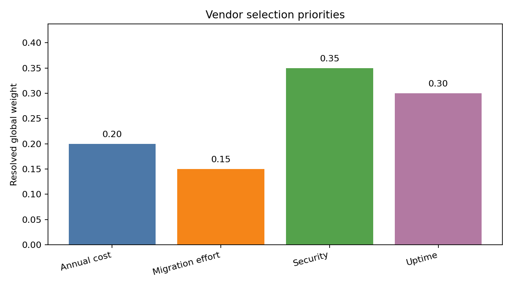

The resolved weights are:

| Criterion | Weight |
| --- | ---: |
| Annual cost | 0.20 |
| Migration effort | 0.15 |
| Security | 0.35 |
| Uptime | 0.30 |

Security and uptime dominate the decision. Cost matters, but it is not enough for the
cheapest vendor to win if reliability and security are weak.

### Vendor Performance

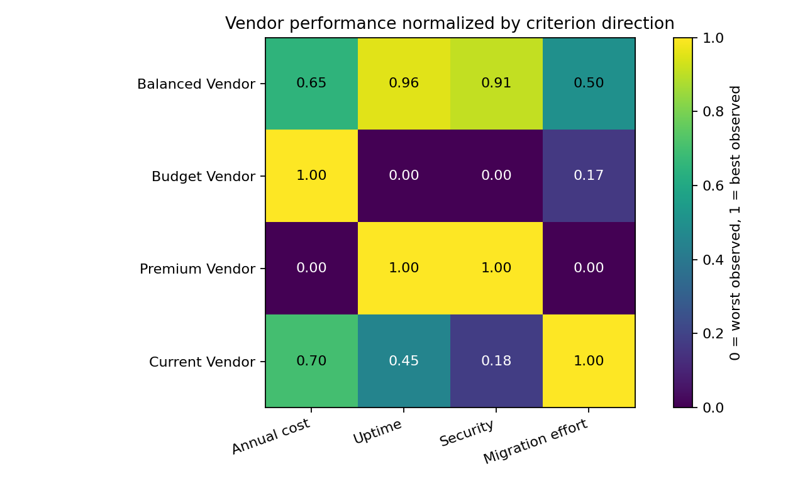

The normalized performance heatmap shows the tradeoff:

- Balanced Vendor is strong on uptime, security, and migration effort while staying
  reasonably priced.
- Budget Vendor wins on cost but performs poorly on security and uptime.
- Premium Vendor is excellent on uptime and security but is expensive and harder to
  migrate to.
- Current Vendor is easy to keep but weak on security.

### Score Contributions

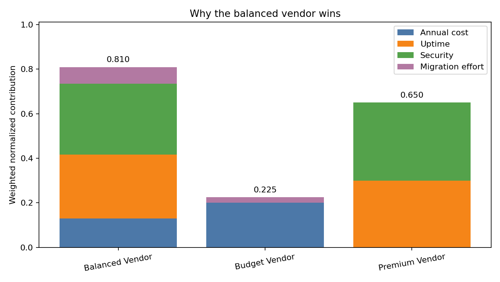

Weighted-sum is useful because it can explain the score. Each stacked bar shows how much
each criterion contributes to the final score.

The score table from `docs/vendor_selection_result.json` is:

| Alternative | Weighted-sum score | Candidate rank |
| --- | ---: | ---: |
| Balanced Vendor | 0.810 | 1 |
| Premium Vendor | 0.650 | 2 |
| Budget Vendor | 0.225 | 3 |

The reference vendor, Current Vendor, scores `0.488`. It is included in the result JSON
for comparison but excluded from the default candidate ranking.

### Clear Ranking

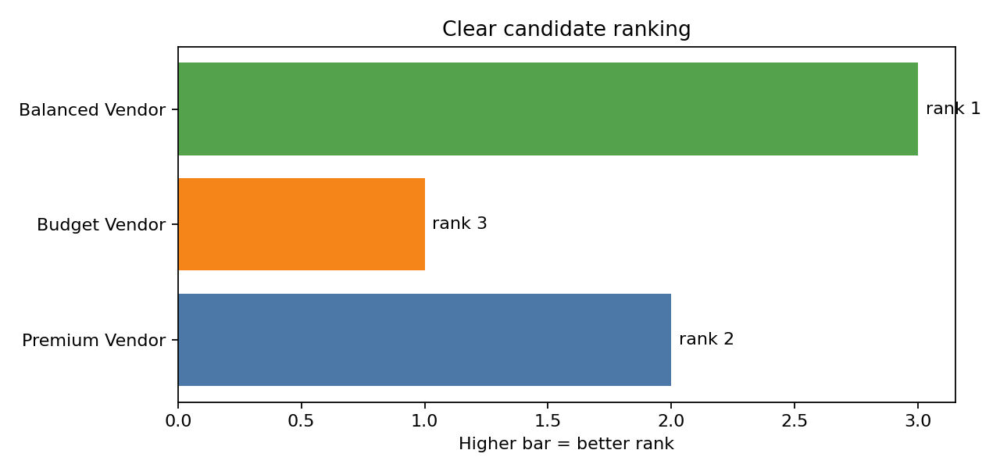

The candidate ranking is:

```json
[
  {
    "rank": 1,
    "alternatives": ["balanced_vendor"],
    "score": 0.809699
  },
  {
    "rank": 2,
    "alternatives": ["premium_vendor"],
    "score": 0.65
  },
  {
    "rank": 3,
    "alternatives": ["budget_vendor"],
    "score": 0.225
  }
]
```

This is the clean recommendation case: Balanced Vendor is the best overall choice under
the stated weights and normalized performance values.

### ELECTRE Cross-Check

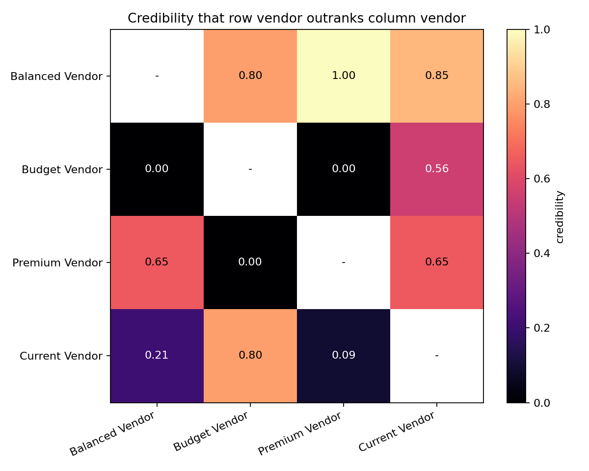

The vendor demo also generates an ELECTRE III credibility matrix as a cross-check. It
shows that Balanced Vendor credibly outranks Budget Vendor, Premium Vendor, and Current
Vendor at the default cutoff. That makes the recommendation more robust than a score table
alone.

---

## Example 2: Ambiguous Tradeoff With ELECTRE III

The office lease demo executes the office lease example from above. It produces both a
weighted-sum score and an ELECTRE III outranking analysis.

Run it from the repository root:

```bash
python examples/office_lease_demo.py
```

The script writes a disposable project here:

```text
examples/output/office_lease_selection/
```

That project is ignored by Git. The reusable outputs are written here:

```text
docs/office_lease_result.json
docs/office_lease_weighted_sum_result.json
docs/office_lease_lambda_sweep.json
docs/figures/
```

The demo script deliberately calls the CLI through `subprocess`, so it exercises the same
workflow a user would run in a shell. The helper function is:

```python
def mcda(args: list[str], project: bool = True) -> dict:
    command = [sys.executable, "-m", "mcda.cli"]
    if project:
        command.extend(["--project", str(PROJECT)])
    command.extend(args)
    completed = subprocess.run(command, cwd=ROOT, text=True, capture_output=True, check=False)
    if completed.returncode != 0:
        raise RuntimeError(f"Command failed: {' '.join(command)}\n{completed.stdout}\n{completed.stderr}")
    return json.loads(completed.stdout)["data"]
```

The result is ordinary JSON, so downstream analysis can use standard Python:

```python
result = json.loads(Path("docs/office_lease_result.json").read_text())
weights = result["resolved_weights"]
credibility = result["credibility"]
ranking = result["candidate_ranking"]
```

For the weighted-sum comparison:

```python
weighted = json.loads(Path("docs/office_lease_weighted_sum_result.json").read_text())
scores = weighted["scores"]
```

### Resolved Weights

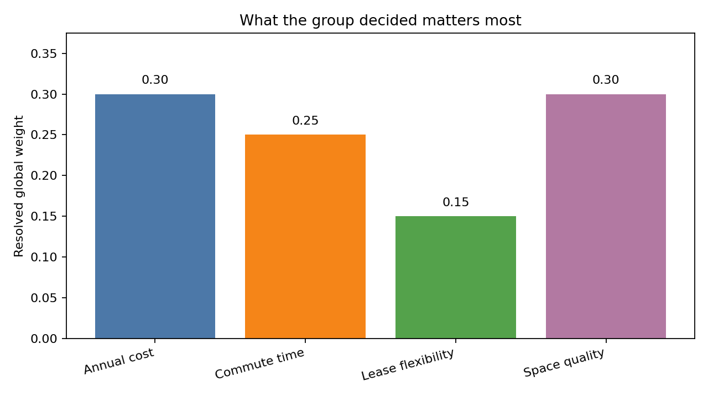

The group’s median normalized weights are:

| Criterion | Weight |
| --- | ---: |
| Annual cost | 0.30 |
| Commute time | 0.25 |
| Space quality | 0.30 |
| Lease flexibility | 0.15 |

The important point is that the tool records raw participant weights, then resolves them
into normalized global leaf weights for analysis. In this case, cost and quality carry the
most influence, commute is close behind, and flexibility matters but has less leverage.

The plotting code is straightforward:

```python
weights = result["resolved_weights"]
criteria = list(weights)
values = [weights[criterion] for criterion in criteria]

fig, ax = plt.subplots(figsize=(8, 4.5))
ax.bar([DISPLAY_NAMES[c] for c in criteria], values)
ax.set_ylabel("Resolved global weight")
ax.set_title("What the group decided matters most")
fig.tight_layout()
fig.savefig("docs/figures/office_lease_weights.png", dpi=160)
```

### Normalized Performance

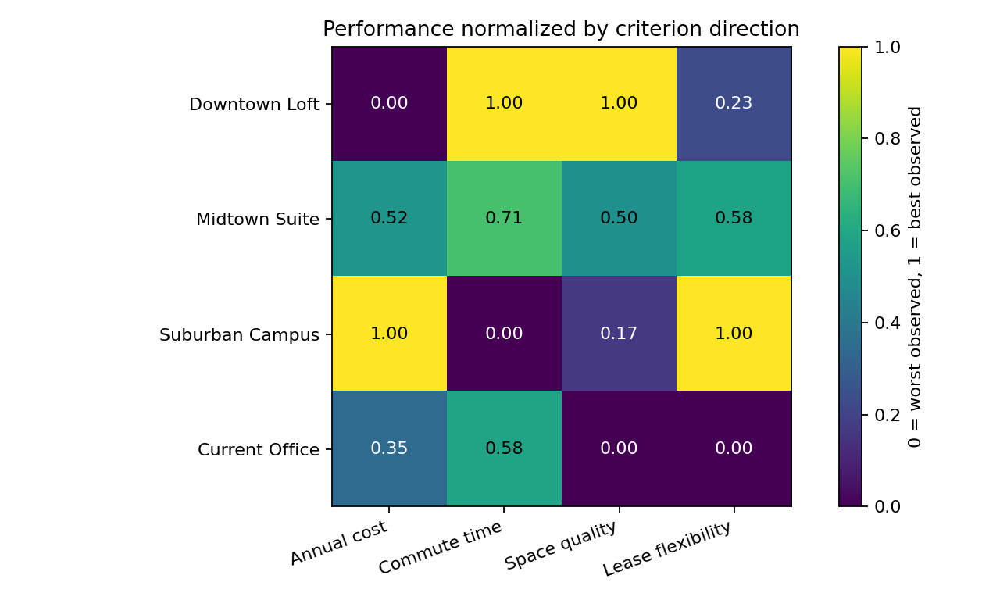

Raw criterion values have different units: thousands of dollars, commute minutes, and
0-100 scores. For visualization, the demo normalizes each criterion so:

- `1.0` means best observed value on that criterion
- `0.0` means worst observed value on that criterion
- `min` criteria are reversed so lower raw values become higher normalized scores

This makes the tradeoffs visible:

- Downtown Loft is excellent on commute and space quality, but poor on cost.
- Suburban Campus is excellent on cost and flexibility, but poor on commute.
- Midtown Suite is the compromise option.
- Current Office is useful as a baseline, but is weak on space quality and flexibility.

The normalization code is:

```python
def normalized_performance(result: dict) -> dict[str, dict[str, float]]:
    perf = result["resolved_perf"]
    normalized = {alt: {} for alt in perf}
    for criterion_id, spec in CRITERIA.items():
        values = [perf[alt][criterion_id] for alt in perf]
        low, high = min(values), max(values)
        span = high - low or 1
        for alternative_id in perf:
            raw = perf[alternative_id][criterion_id]
            if spec["direction"] == "max":
                score = (raw - low) / span
            else:
                score = (high - raw) / span
            normalized[alternative_id][criterion_id] = score
    return normalized
```

### Credibility Matrix

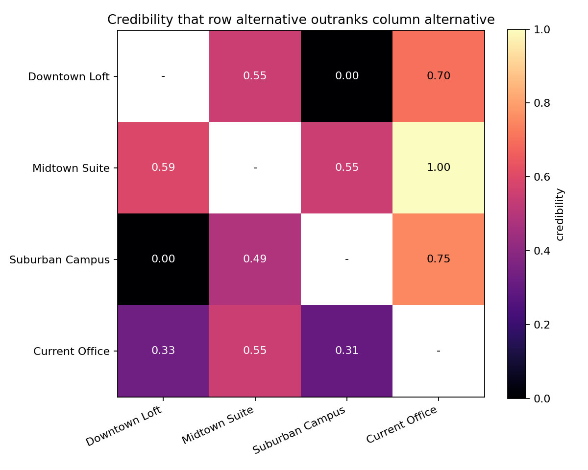

The credibility matrix is the core ELECTRE III output. Each cell answers:

```text
How credible is it that the row alternative outranks the column alternative?
```

At the default lambda of `0.75`, a row alternative only outranks a column alternative when
its credibility is at least `0.75`.

In the generated result:

- Midtown Suite strongly outranks Current Office with credibility `1.00`.
- Suburban Campus outranks Current Office at exactly `0.75`.
- Downtown Loft does not clearly outrank the other candidates because its cost and
  flexibility weaknesses matter.
- Suburban Campus does not clearly outrank the other candidates because the commute veto
  pressure is severe.

This is where ELECTRE differs from a simple weighted average: it can say “these options
are not cleanly comparable” instead of forcing a fragile total ordering.

### Pairwise Relations

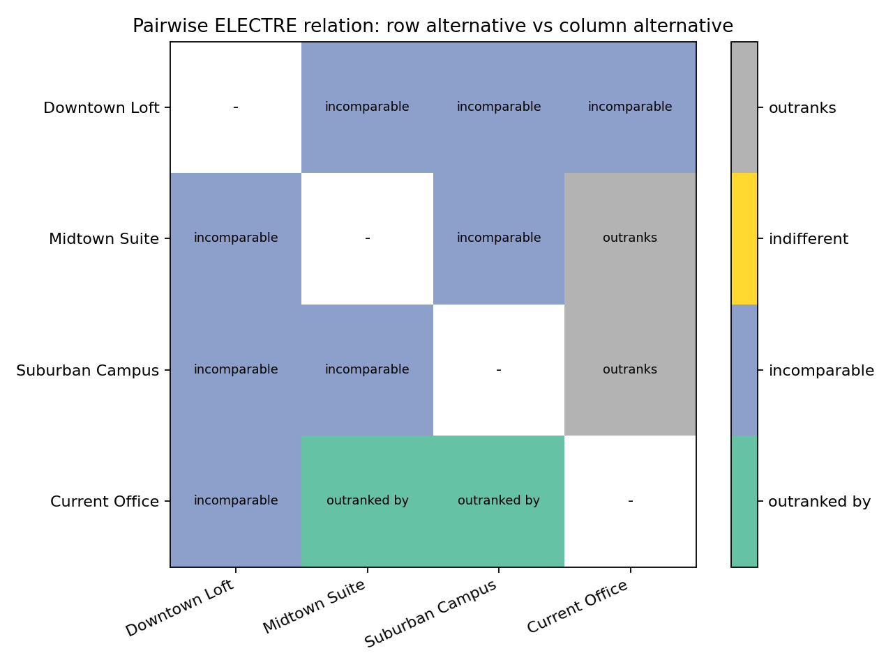

The relation matrix converts credibility values into ELECTRE relations:

- `outranks`
- `outranked by`
- `indifferent`
- `incomparable`

For this scenario, the most important relation is that both Midtown Suite and Suburban
Campus outrank the Current Office reference. That supports the practical conclusion that
moving is plausibly better than staying put.

Among the three candidates, however, the default model leaves them incomparable. That is
a useful result: the model is telling the facilitator that the final decision depends on
a real tradeoff, not a hidden arithmetic winner.

### Candidate Ranking

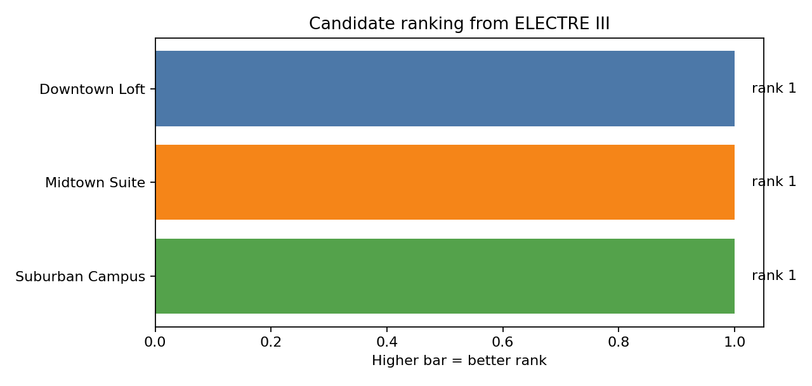

The default candidate ranking is:

```json
[
  {
    "rank": 1,
    "alternatives": [
      "downtown_loft",
      "midtown_suite",
      "suburban_campus"
    ]
  }
]
```

This does not mean the three offices are identical. It means that, under the default
lambda and thresholds, none of the candidates decisively outranks the others.

That gives the decision-maker a concrete next step:

- revisit the commute veto threshold
- test a different lambda
- ask whether cost or quality should receive more weight
- collect more evidence on space quality or flexibility
- make an explicit managerial judgment among the unresolved candidates

### Weighted-Sum Comparison

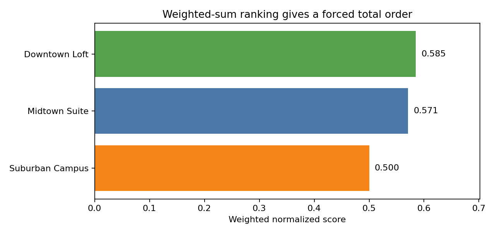

Weighted-sum does produce a total order for the same office data:

| Alternative | Weighted-sum score | Candidate rank |
| --- | ---: | ---: |
| Downtown Loft | 0.585 | 1 |
| Midtown Suite | 0.571 | 2 |
| Suburban Campus | 0.500 | 3 |

This is useful, but the tiny gap between Downtown Loft and Midtown Suite is a warning.
The ELECTRE analysis explains why the total order should not be overinterpreted: the
options make different tradeoffs, and no candidate decisively outranks the others at the
chosen thresholds and lambda.

### Lambda Sensitivity

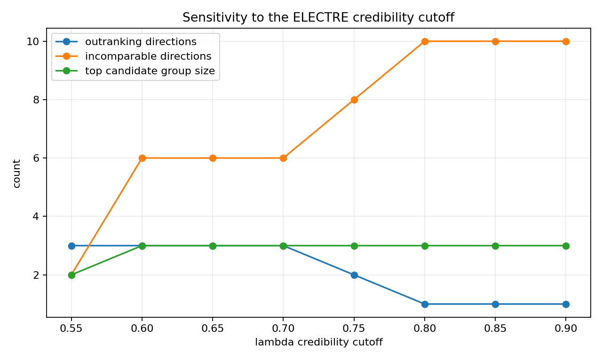

The demo also reruns the analysis over several lambda values:

```python
rows = []
for lambda_value in [0.55, 0.60, 0.65, 0.70, 0.75, 0.80, 0.85, 0.90]:
    result = mcda(["analyze", "run", "--lambda", f"{lambda_value:.2f}"])
    relations = [
        relation
        for source, targets in result["relations"].items()
        for target, relation in targets.items()
        if source != target
    ]
    rows.append(
        {
            "lambda": lambda_value,
            "outranks": relations.count("outranks"),
            "incomparable": relations.count("incomparable"),
            "top_candidate_group_size": len(result["candidate_ranking"][0]["alternatives"]),
        }
    )
```

The sweep shows how demanding the outranking standard is:

| Lambda | Outranking directions | Incomparable directions | Top candidate group size |
| ---: | ---: | ---: | ---: |
| 0.55 | 3 | 2 | 2 |
| 0.60 | 3 | 6 | 3 |
| 0.65 | 3 | 6 | 3 |
| 0.70 | 3 | 6 | 3 |
| 0.75 | 2 | 8 | 3 |
| 0.80 | 1 | 10 | 3 |
| 0.85 | 1 | 10 | 3 |
| 0.90 | 1 | 10 | 3 |

As lambda rises, the model requires stronger evidence before saying one option outranks
another. Incomparability increases. This is useful in deliberation because it separates
robust conclusions from conclusions that depend on an aggressive cutoff.

### What The Approach Delivers

For this example, the tool does not produce a simplistic “winner.” It produces a structured
decision picture:

- The group’s resolved priorities are explicit.
- The performance tradeoffs are visible criterion by criterion.
- The current office is beaten by plausible new options, so moving looks justified.
- The three new candidate offices remain meaningfully hard to compare.
- The final choice should focus on the unresolved tradeoff: pay more for Downtown Loft’s
  commute and quality, accept Midtown Suite’s compromise, or choose Suburban Campus for
  cost and flexibility despite the commute burden.

That is the point of the approach: it narrows the decision, exposes the tradeoffs, and
shows where judgment is still needed.

---

## Sessions

Sessions are useful when you want to group a round of elicitation.

```bash
mcda session start --id round_1 --participants alice --participants bob --participants carol
```

Any new weight, threshold, or performance record written while the session is open will
include:

```json
{
  "session": "round_1"
}
```

Close the session:

```bash
mcda session close --notes "Initial elicitation complete."
```

Sessions are administrative state, not a formal audit log.

---

## Current Limitations

Implemented:

- `.mcda/` project initialization and discovery
- JSON-first CLI
- participants
- alternatives
- criteria and criterion groups
- weight records
- threshold records
- performance records and abstentions
- sessions
- policy listing and setting
- weighted-sum analysis
- ELECTRE III analysis
- latest-result candidate ranking

Planned:

- CSV and JSON imports
- report generation
- briefing generation
- sensitivity sweeps
- richer human-readable tables
- stricter all-issues-at-once validation
- removal commands
- more complete policy behavior
- additional MCDA methods

---

## Development

Run tests:

```bash
pytest -q
```

The current test suite exercises the first vertical slice:

- project creation under `.mcda/`
- ID validation
- session stamping
- office lease scenario setup
- hierarchical median weight aggregation
- weighted-sum analysis
- ELECTRE III analysis
- candidate/reference ranking separation
